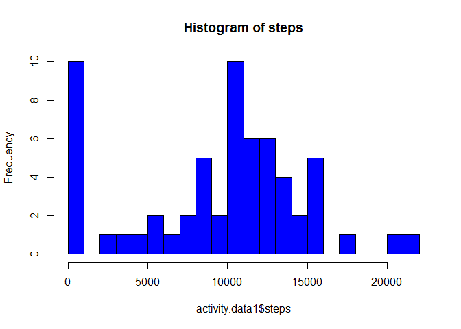
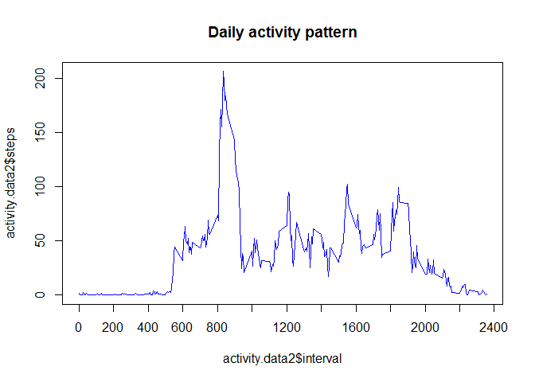
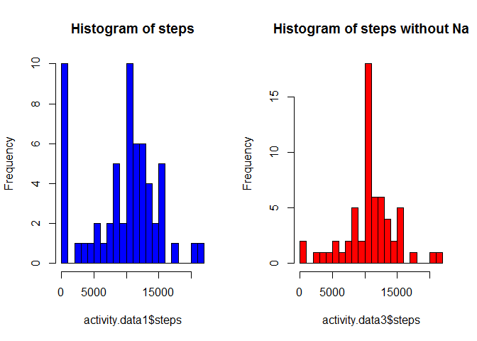
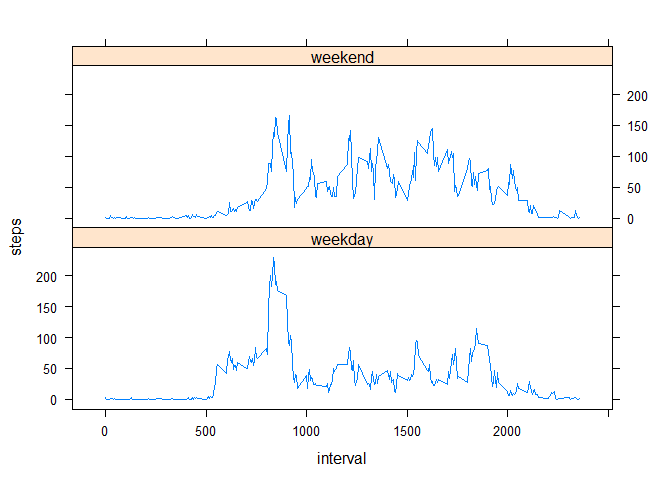

# Reproducible Research: Peer Assessment 1

```
## 
## Attaching package: 'dplyr'
## 
## The following objects are masked from 'package:lubridate':
## 
##     intersect, setdiff, union
## 
## The following object is masked from 'package:stats':
## 
##     filter
## 
## The following objects are masked from 'package:base':
## 
##     intersect, setdiff, setequal, union
```

## Loading and preprocessing the data


```r
activity.data <-read.csv("activity.csv")
activity.data$date <- as.Date(activity.data$date)
```

## What is mean total number of steps taken per day?
1. Histogram of the total number of steps taken each day

```r
activity.data1 <- activity.data %>% group_by(date) %>% summarize(steps = sum(steps, na.rm = TRUE))
hist(x=activity.data1$steps, breaks=20, col="blue", main="Histogram of steps")
```

 

2. The mean and median total number of steps taken per day

```r
Mean <- format(mean(activity.data1$steps, na.rm = TRUE), digits = 5, nsmall =2)
Median <- format(median(activity.data1$steps, na.rm = TRUE), digits = 5, nsmall =2)
```
Mean: 9354.23 
Median: 10395

## What is the average daily activity pattern?
1. Time series plot of the 5-minute interval (x-axis) and the average number of steps taken, averaged across all days (y-axis)

```r
activity.data2 <- activity.data %>% group_by(interval) %>% summarize(steps = mean(steps, na.rm = TRUE)) 
plot(x = activity.data2$interval, y = activity.data2$steps, type = "l", col = "blue", main = "Daily activity pattern", lab = c(12,5,7))
```

 

2. 5-minute interval, on average across all the days in the dataset, containing the maximum number of steps:

```r
Max <- format(max(activity.data2$steps, na.rm = TRUE), digits = 5, nsmall =2)
interval.Max <-activity.data2[activity.data2$steps==max(activity.data2$steps, na.rm = TRUE),1]
```
Interval: 835
Number of steps: 206.17

## Imputing missing values

1. Number of missing values in the dataset (i.e. the total number of rows with NAs):


```r
NA.rows <- activity.data[!complete.cases(activity.data), ]
nrow(NA.rows)
```

```
## [1] 2304
```

2. Devise a strategy for filling in all of the missing values in the dataset. The strategy does not need to be sophisticated. For example, you could use the mean/median for that day, or the mean for that 5-minute interval, etc.

The strategy consist in filling all the missing values using the mean for that interval


3. New dataset that is equal to the original dataset but with the missing data filled in.


```r
activity.data.noNA <- activity.data
for (i in 1:nrow(activity.data.noNA)) {
      if (is.na(activity.data.noNA[i, 1]))
          {activity.data.noNA[i, 1] <- activity.data2[activity.data2$interval ==activity.data.noNA[i, 3], 2] }
}
```


4. Histogram of the total number of steps taken each day and Calculate and report the mean and median total number of steps taken per day. 


```r
activity.data3 <- activity.data.noNA %>% group_by(date) %>% summarize(steps = sum(steps, na.rm = TRUE))

par(mfcol = c(1, 2))
hist(x=activity.data1$steps, breaks=20, col="blue", main="Histogram of steps")

hist(x=activity.data3$steps, breaks=20, col="red", main="Histogram of steps without Na")
```

 

```r
Mean2 <- format(mean(activity.data3$steps, na.rm = TRUE), digits = 5, nsmall =2)
Median2 <- format(median(activity.data3$steps, na.rm = TRUE), digits = 5, nsmall =2)
```

Mean2: 10766.19 
Median2: 10766.19

Do these values differ from the estimates from the first part of the assignment? 
These values are slightly higher than the orinal indicators

What is the impact of imputing missing data on the estimates of the total daily number of steps?
The different between the median and the mean is increased


## Are there differences in activity patterns between weekdays and weekends?

1. Create a new factor variable in the dataset with two levels -- "weekday" and "weekend" indicating whether a given date is a weekday or weekend day.


```r
activity.data.noNA$day <- weekdays(activity.data.noNA$date)
activity.data.noNA <- mutate(activity.data.noNA, day = factor(1 * (day %in% c("sábado","domingo", "saturday", "sunday" )), labels = c("weekday", "weekend")))

activity.data.noNA2 <- activity.data.noNA %>% group_by(day,interval) %>% summarize(steps = mean(steps, na.rm = TRUE))
```


2. Panel plot containing a time series plot of the 5-minute interval (x-axis) and the average number of steps taken, averaged across all weekday days or weekend days (y-axis). The plot should look something like the following, which was created using simulated data:

```r
xyplot(steps ~ interval | day, data = activity.data.noNA2, layout = c(1, 2), type = "l")
```

 
